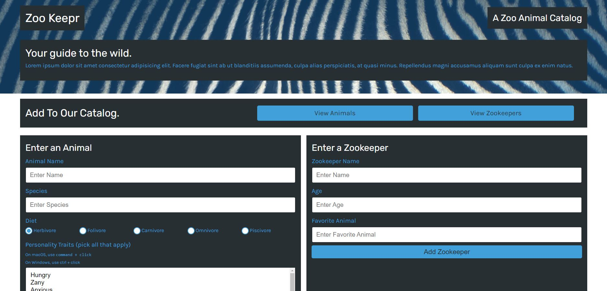
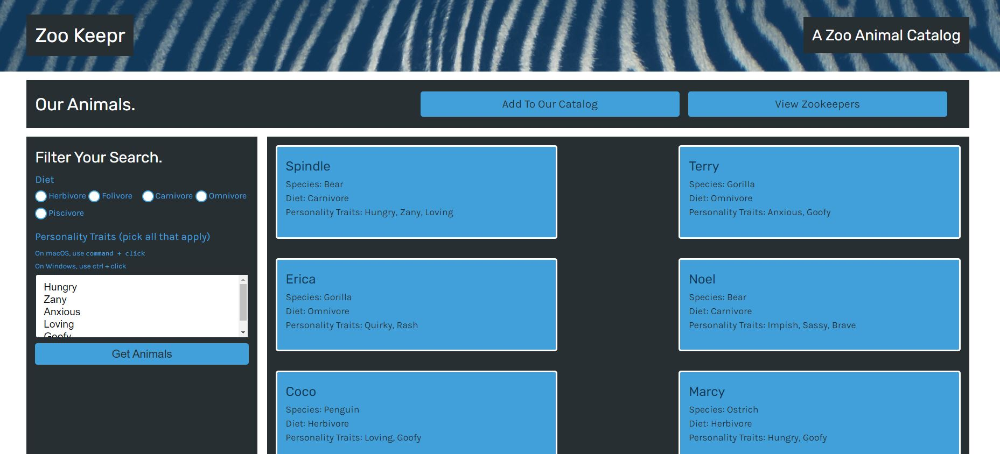
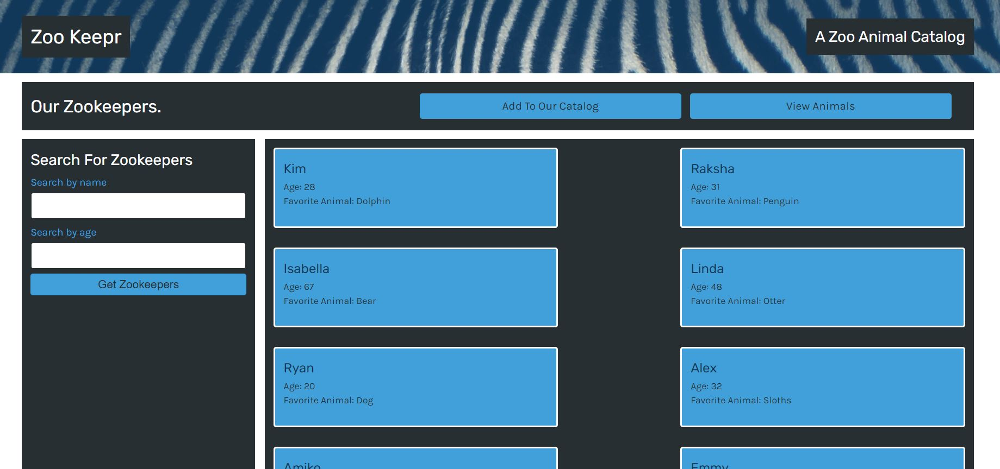

# zookeepr


## Description

In this application, I have created a web server for an online zoo catalog, called Zoo Keepr. This website allows animal enthusiasts to access the animals and zookeepers data from different locations and browsers without needing to download them to their devices.

## Table of Contents

* [Description](#description)
* [Table of Contents](#table-of-contents)
* [Usage](#usage)
* [License](#license)
* [Contributing](#contributing)
* [Screenshots](#screenshots)
* [Live-URL](#Live-URL)
* [Questions](#questions)

## Usage

Please first install node.js and then run the following commands into your terminal: 

```
git clone <from-repository-on-github>
npm install
npm start
```
Then view the result in your browser using the following link: http://localhost:3001/

Or checkout the depoloyed application on heroku. Please refer to the "Live-URL" section.

## License

Please see the following link for license information: 
[GitHub-license](./utils/license-MIT.txt)

## Contributing

Please first submit a new issue for the change you want to make in this repository on GitHub. Then, git clone the repo and do the changes locally on your machine. When you are done with your changes, create a pull request on the GitHub repository.

## Screenshots

Please see below for the snapshots of three pages of Zoo Keepr website:

* Main Page



* View Animals



* View Zookeepers



## Live-URL

Here is the live url of deployed application:
[Live URL](https://zookeepr-ss-4521.herokuapp.com/)

## Questions

If you have any questions please use the following two links to contact me:

* [GitHub](https://github.com/sshahram)

* [Email Address](mailto:shirin.shahram23@gmail.com)